<p align="center">
  
</p>

<h1 align="center">[Discord] - FarmMergeValley Injector</h1>

<p align="left">
  FMV Injector lets you set up various methods for modifying content in the Farm Merge Valley discord game. This project follows on from @wooslow's repositorie on the same subject. Perform these steps preferably from a Google Chrome browser. There is currently no guarantee that these methods will work on other browsers.
  These methods go against the rules of the game's developers, and waves of bans have already occurred. I am in no way responsible for your actions. Please use this tool with full knowledge of the risks involved.
</p>


## Disclaimer

|FMV Injector was made for Educational purposes   |
|-------------------------------------------------|
This project was created only for good purposes and personal use.
By using this Tool, you agree that you hold responsibility and accountability of any consequences caused by your actions.

## Features

- [x] - [giveInventoryItem](https://github.com/AstraaDev/Discord-FarmMergeValley-Injector) - Obtain any object in unlimited quantities.
- [x] - [spawnUpgradeCard](https://github.com/AstraaDev/Discord-FarmMergeValley-Injector) - Spawn an upgrade card.
- [x] - [spawnBubbledObject](https://github.com/AstraaDev/Discord-FarmMergeValley-Injector) - Spawn a bubble object (gift, coins, gems, energy, crates, chests, keys, decorations).
- [x] - [removeAllObstacles](https://github.com/AstraaDev/Discord-FarmMergeValley-Injector) - remove all obstacles (trees and stones) from the map.
- [x] - [setLuckyMergeChance](https://github.com/AstraaDev/Discord-FarmMergeValley-Injector) - Set the lucky merge chance of objects.

## Common part of each method
Each of the methods described here works in the same way. The game needs to be “paused” at the right moment to access certain elements that are normally blocked. The differences between these methods are the information to be retrieved, the precise moment to break the script, the action to be taken to break the script, etc...
Even if these parts change depending on the method, the beginning remains the same.

#### Setup
- Launch of Farm Merge Valley on discord *(and never close it again until the end)*
- Open the browser console (by pressing `CTRL`+`SHIFT`+`I` on Windows/Linux or `Cmd`+`Opt`+`I` on MacOS)
- Your game should now be "paused". In the **CONSOLE** tab, write the following command and press `ENTER` :
```js
Function.prototype.constructor = function() {};
```
- Click on the `Resume script execution` button *(see image below) (it's the blue button)*
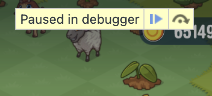

- In the **SOURCE** tab, find the file named main.js located at `top/1187.discordsays.com/1187.discordsays.com/main.1401.js` *(see image below)*
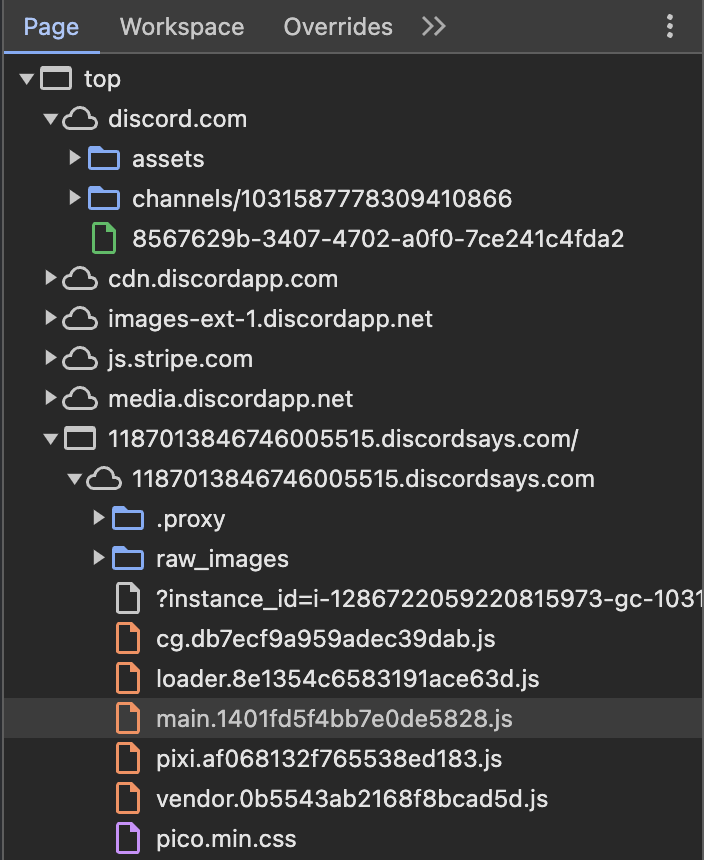

From now on, the next steps will depend on each method. Make sure you've followed exactly the steps described in this section before moving on.

## [METHOD 1] : giveInventoryItem
<details>
<summary>What you can get with this method ?</summary>
  
| Parameter       | Description           |
| :-------------- | :-------------------- |
| `coins`         | Yellow coins          |
| `gems`          | Purple gems           |
| `exp`           | Experience            |
| `levels`        | Levels                |
| `crates`        | Crates with items     |
| `energy`        | Energy for activities |
| `tickets`       | Train tickets         |
| `wheat`         | Wheat                 |
| `egg`           | Egg                   |
| `sunflower`     | Sunflower             |
| `milk`          | Milk                  |
| `sugarcane`     | Sugarcane             |
| `bacon`         | Bacon                 |
| `carrot`        | Carrot                |
| `goatmilk`      | Goat milk             |
| `soybeans`      | Soybeans              |
| `wool`          | Wool                  |
| `corn`          | Corn                  |
| `fur`           | Fur                   |
| `coffeebeans`   | Coffee beans          |
| `tomato`        | Tomato                |
| `avocado`       | Avocado               |
| `truffle`       | Truffle               |
</details>

<details>
<summary>Click to expand the information</summary>

Make sure you've followed exactly the steps described in the “Common part of each method” section before moving on to this one.

#### Injection
- In `main.js` file,
- Search the file (by pressing `CTRL`+`F`)
- Write the following command and press `ENTER` :
```js
this['servi' + 'ces']['mapGr' + 'id']['getCe' + 'll']
```
- There will normally be 9 results. Navigate to the third result and set a breakpoint by clicking on the left of the line in the grey area *(see image below)*
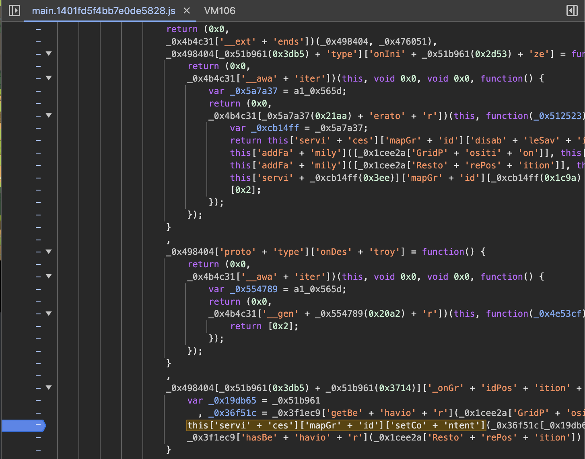

- Return to the game and click on an object *(the game should stop again)*
- In the **CONSOLE** tab, write the following command and press `ENTER` :
```js
worldServices = this.services
```
- You can now go back to the `main.js` file in the **SOURCE** tab, then remove the breakpoint *(by clicking on it again)* and click on the `Resume script execution` button again

#### Setting up the function
- In the **CONSOLE** tab, write the following command and press `ENTER` :
```js
let giveInventoryItem = (target, amount) => {
    return worldServices.rewardService.giveInventoryReward({
        "reward": {"key": target, "amount": amount},
        "parent": worldServices.mapGridView._view.parent.parent.parent
    });
}
```

#### Use injection
You're all set! Now all you have to do is enter the following command in the **CONSOLE** tab and press `ENTER` :
```js
giveInventoryItem("item", amount);
```
Don't forget to replace the `item` argument with one of the parameters in the `What you can get with this method?` table of this method, and `amount` with the amount you want.
</details>

## [METHOD 2] : spawnUpgradeCard
<details>
<summary>Click to expand the information</summary>
Make sure you've followed exactly the steps described in the “Common part of each method” section before moving on to this one.
  
#### Injection
- In `main.js` file,
- Search the file (by pressing `CTRL`+`F`)
- Write the following command and press `ENTER` :
```js
this['_forc' + 'edLoo' + 't']['lengt' + 'h']
```
- Set a breakpoint by clicking on the left of the line in the grey area *(see image below)*
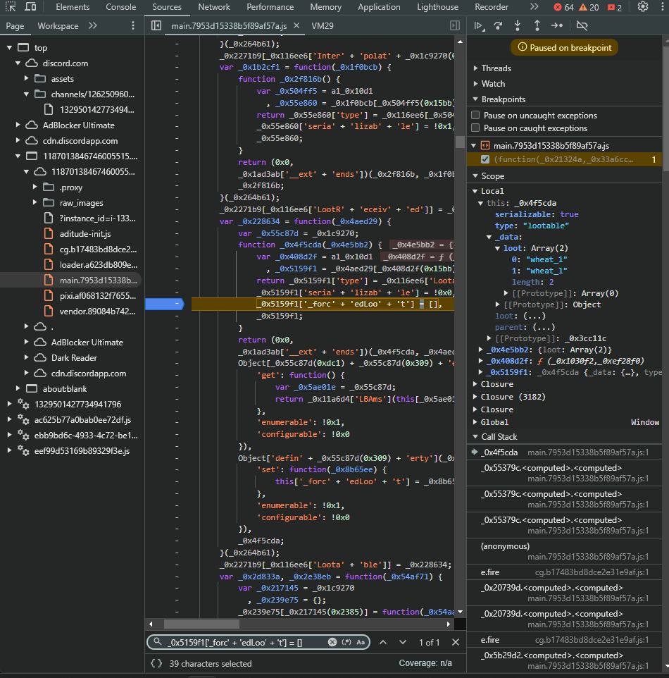

- Return to the game and merge items *(the game should stop again)*
- In the **SOURCE** tab, find the loot section at `Local/this/_data/loot` *(see image below)*
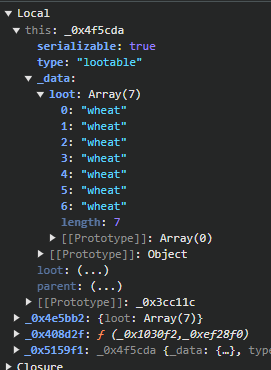

- Replace one of the elements with `“upgrade_card_1”`, `“upgrade_card_2”` or `“upgrade_card_3”` to suit your needs *(see image below)*
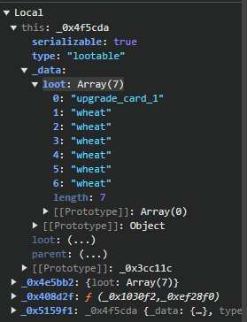

- You can now go back to the `main.js` file in the **SOURCE** tab, then remove the breakpoint *(by clicking on it again)* and click on the `Resume script execution` button again
- All you have to do now is click on the merged item in the game, and the upgrade card should appear.

</details>

## [METHOD 3] : spawnBubbledObject
<details>
<summary>What you can get with this method ?</summary>

### Consumable

| Parameter                         | Description                      | Image                                                                                    |
| :-------------------------------- | :------------------------------- | :--------------------------------------------------------------------------------------- |
| `ticket`                          | Ticket                           |                           |
| `coin_1`                          | Coins (up to coin_8)             |                           |
| `gem_1`                           | Gems (up to gem_6)               | 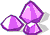                           |
| `crate_1`                         | Crates (up to crate_2)           | 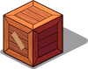                         |
| `energy_1`                        | Energy (up to energy_4)          |                         |
| `wood_1`                          | Wood (up to wood_8)              |                           |
| `stone_1`                         | Stone (up to stone_8)            | 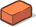                         |
| `tool_1`                          | Tool (up to tool_10)             |                           |
| `flower_1`                        | Flower (up to flower_10)         | 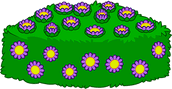                        |
| `sapling_1`                       | Sapling (up to sapling_3)        | 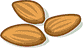                       |
| `greenhouse_1`                    | Greenhouse (up to greenhouse_12) | 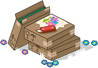                    |
| `toolbox_small`                   | Small toolbox                    |                    |
| `toolbox_medium`                  | Medium toolbox                   | 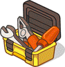                  |
| `toolbox_large`                   | Large toolbox                    | 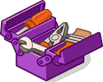                   |
| `rock_small`                      | Small rock                       | 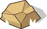                      |
| `rock_medium`                     | Medium rock                      | 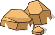                     |
| `rock_large`                      | Large rock                       | 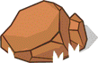                      |
| `tree_small`                      | Small tree                       | 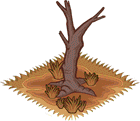                      |
| `tree_medium`                     | Medium tree                      | 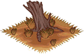                     |
| `tree_large`                      | Large tree                       |                       |
| `reward_crate_daily_bonus`        | Daily bonus gift                 |         |
| `reward_crate_key_bronze`         | Bronze key                       |                |
| `reward_crate_key_silver`         | Silver key                       |                |
| `reward_crate_key_gold`           | Gold key                         |                  |
| `reward_crate_bronze`             | Bronze chest                     | 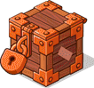       |
| `reward_crate_silver`             | Silver chest                     | 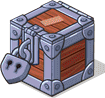       |
| `reward_crate_gold`               | Gold chest                       | 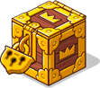         |
| `golden_carrot`                   | Golden carrot                    |                    |
| `reward_crate_key_golden_carrot`  | Golden carrot key                |   |
| `reward_crate_golden_carrot`      | Golden carrot chest              |       |
| `golden_pumpkin`                  | Golden pumpkin                   |                   |
| `reward_crate_key_golden_pumpkin` | Golden pumpkin key               |  |
| `reward_crate_golden_pumpkin`     | Golden pumpkin chest             | 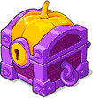     |
| `reward_crate_key_jingleballs`    | Jingleballs key                  |     |
| `reward_crate_jingleballs`        | Jingleballs chest                |         |


### Decoration
#### Farm

| Parameter                   | Description     | Image                                                                                       |
| :-------------------------- | :-------------- | :------------------------------------------------------------------------------------------ |
| `decorative_barn`           | Barn            | 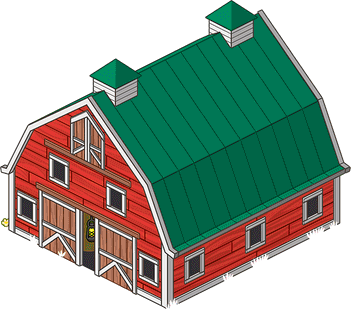              |
| `decorative_birdshouse`     | Birdshouse      | 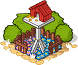        |
| `decorative_chickencoop`    | Chickencoop     | 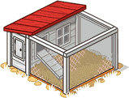       |
| `decorative_doghouse`       | Doghouse        |           |
| `decorative_farmhouse`      | Farmhouse       | 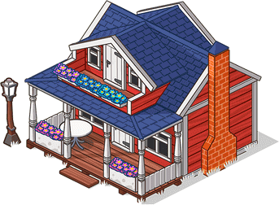         |
| `decorative_feedingtrough`  | Feeding Trough  | 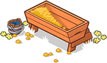     |
| `decorative_flowerpots`     | Flowerpots      | 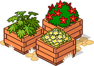        |
| `decorative_fountain`       | Fountain        | 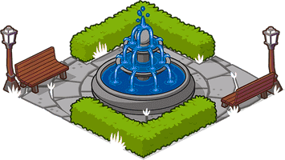          |
| `decorative_haywagon`       | Haywagon        | 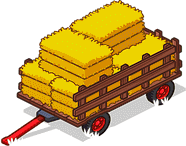          |
| `decorative_lamppost`       | Lamppost        | 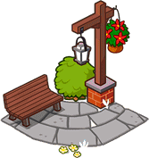          |
| `decorative_milktank`       | Milktank        | 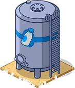          |
| `decorative_picknicktable`  | Picnic Table    | 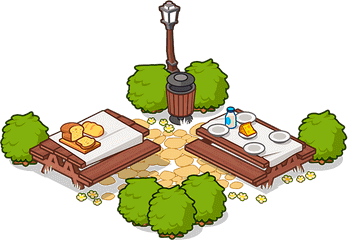     |
| `decorative_shed`           | Shed            | 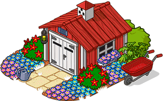              |
| `decorative_silo`           | Silo            | 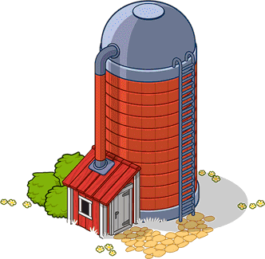              |
| `decorative_stoneflowerpot` | Stone Flowerpot | 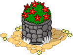    |
| `decorative_toilet`         | Toilet          | 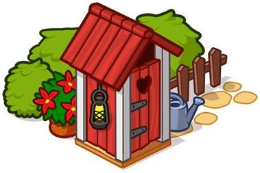            |
| `decorative_watertower`     | Water Tower     | 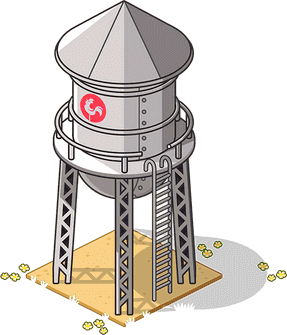        |
| `decorative_well`           | Well            | 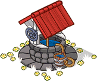              |
| `decorative_windmill`       | Windmill        | 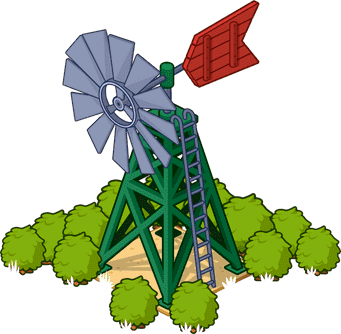          |

#### Halloween

| Parameter                              | Description         | Image                                                                                                        |
| :------------------------------------- | :------------------ | :----------------------------------------------------------------------------------------------------------- |
| `decorative_halloween_blackcat`        | BlackCat            | 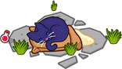            |
| `decorative_halloween_cauldron`        | Cauldron            | 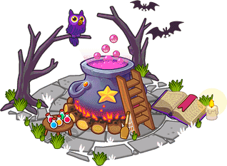            |
| `decorative_halloween_ghosts`          | Ghosts              |               |
| `decorative_halloween_grandfatherclock`| Grandfather Clock   | 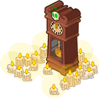    |
| `decorative_halloween_grave01`         | Grave 01            | 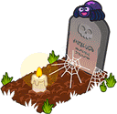             |
| `decorative_halloween_grave02`         | Grave 02            | 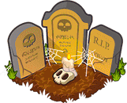             |
| `decorative_halloween_graveyard`       | Graveyard           | 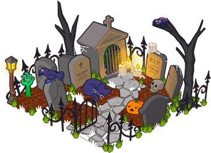           |
| `decorative_halloween_hauntedhouse`    | Haunted House       | 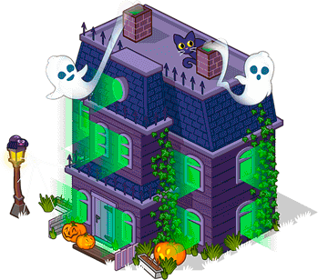        |
| `decorative_halloween_pumpkinpatchbig` | Pumpkin Patch (Big) | 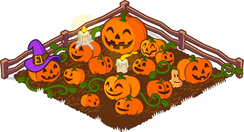     |
| `decorative_halloween_pumpkins01`      | Pumpkins 01         |           |
| `decorative_halloween_pumpkins02`      | Pumpkins 02         | 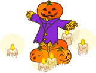          |
| `decorative_halloween_pumpkins03`      | Pumpkins 03         |           |
| `decorative_halloween_pumpkins04`      | Pumpkins 04         |           |
| `decorative_halloween_skeletonbench`   | Skeleton Bench      |        |
| `decorative_halloween_skeletoncarousel`| Skeleton Carousel   |     |
| `decorative_halloween_skeletonpicnic`  | Skeleton Picnic     |       |
| `decorative_halloween_skullaltar`      | Skull Altar         |           |
| `decorative_halloween_treeface`        | Tree Face           |             |
| `decorative_halloween_well`            | Well                |                 |

#### Christmas

| Parameter                                    | Description           | Image                                                                                                                               |
| :------------------------------------------- | :-------------------- | :---------------------------------------------------------------------------------------------------------------------------------- |
| `decorative_christmas_candygate`             | CandyGate             |                                   |
| `decorative_christmas_elfmail`               | ElfMail               |                                     |
| `decorative_christmas_elfteddy`              | ElfTeddy              |                                    |
| `decorative_christmas_elftrain`              | ElfTrain              |                                    |
| `decorative_christmas_fireplace`             | Fireplace             |                                   |
| `decorative_christmas_gift01`                | Gift 01               |                                      |
| `decorative_christmas_gift02`                | Gift 02               |                                      |
| `decorative_christmas_gift03`                | Gift 03               |                                      |
| `decorative_christmas_gingerbell`            | Gingerbell            |                                  |
| `decorative_christmas_gingerbreadhouse`      | GingerbreadHouse      |                            |
| `decorative_christmas_gingerbreadhousesmall` | GingerbreadHouseSmall |                       |
| `decorative_christmas_gingerbreadsnow`       | GingerbreadSnow       |                             |
| `decorative_christmas_nutcracker`            | Nutcracker            |                                  |
| `decorative_christmas_santagift`             | SantaGift             |                                   |
| `decorative_christmas_santamail`             | SantaMail             |                                   |
| `decorative_christmas_sleigh`                | Sleigh                |                                      |
| `decorative_christmas_snowcaroling`          | SnowCaroling          |                                |
| `decorative_christmas_snowdinner`            | SnowDinner            |                                  |
| `decorative_christmas_snowfight`             | SnowFight             |                                   |
| `decorative_christmas_snowgifting`           | SnowGifting           |                                 |
| `decorative_christmas_snowglobe`             | SnowGlobe             |                                   |
| `decorative_christmas_snowjello`             | SnowJello             |                                   |
| `decorative_christmas_snowlantern`           | SnowLantern           |                                 |
| `decorative_christmas_snowreindeer`          | SnowReindeer          |                                |
| `decorative_christmas_snowtelescope`         | SnowTelescope         |                               |
| `decorative_christmas_treebig`               | TreeBig               |                                     |
| `golden_christmas_tree_1`                    | GoldenTree 1          |                                          |
| `golden_christmas_tree_2`                    | GoldenTree 2          |                                          |
| `golden_christmas_tree_3`                    | GoldenTree 3          |                                          |
| `golden_christmas_tree_4`                    | GoldenTree 4          |                                          |
| `golden_jingleball_1`                        | GoldenJingleBall 1    |                                              |
| `golden_jingleball_2`                        | GoldenJingleBall 2    |                                              |
| `golden_jingleball_3`                        | GoldenJingleBall 3    |                                              |
| `golden_jingleball_4`                        | GoldenJingleBall 4    |                                              |
</details>

<details>
<summary>Click to expand the information</summary>

Make sure you've followed exactly the steps described in the “Common part of each method” section before moving on to this one.

#### Injection
- In `main.js` file,
- Search the file (by pressing `CTRL`+`F`)
- Write the following command and press `ENTER` :
```js
this['servi' + 'ces']['mapGr' + 'id']['getCe' + 'll']
```
- There will normally be 9 results. Navigate to the third result and set a breakpoint by clicking on the left of the line in the grey area *(see image below)*


- Return to the game and click on an object *(the game should stop again)*
- In the **CONSOLE** tab, write the following command and press `ENTER` :
```js
worldServices = this.services
```
- You can now go back to the `main.js` file in the **SOURCE** tab, then remove the breakpoint *(by clicking on it again)* and click on the `Resume script execution` button again

#### Setting up the function
- In the **CONSOLE** tab, write the following command and press `ENTER` :
```js
let spawnBubbledObject = (target) => {
    return worldServices.rewardService.giveObjectReward({
      "rewards": [target],
      "container": worldServices.mapGridView._view.parent.parent.parent,
      "animationEndEvent": null,
      "bubblePosition": {"x": 0, "y": -200}
    });
}
```

#### Use injection
You're all set! Now all you have to do is enter the following command in the **CONSOLE** tab and press `ENTER` :
```js
spawnBubbledObject("item");
```
Don't forget to replace the `item` argument with one of the parameters in the `What you can get with this method?` table of this method.
</details>

## [METHOD 4] : removeAllObstacles
<details>
<summary>Click to expand the information</summary>
Make sure you've followed exactly the steps described in the “Common part of each method” section before moving on to this one.

#### Injection
- In `main.js` file,
- Search the file (by pressing `CTRL`+`F`)
- Write the following command and press `ENTER` :
```js
this['servi' + 'ces']['mapGr' + 'id']['getCe' + 'll']
```
- There will normally be 9 results. Navigate to the third result and set a breakpoint by clicking on the left of the line in the grey area *(see image below)*


- Return to the game and click on an object *(the game should stop again)*
- In the **CONSOLE** tab, write the following command and press `ENTER` :
```js
worldServices = this.services
```
- You can now go back to the `main.js` file in the **SOURCE** tab, then remove the breakpoint *(by clicking on it again)* and click on the `Resume script execution` button again

#### Use injection
- In the **CONSOLE** tab, write the following command and press `ENTER` :
```js
worldServices.world.getAllGameObjects().filter(x=>x.hasBehavior("hitpoints") && !x.hasBehavior("shovelable") && !x.hasBehavior("movable")).forEach(x=>worldServices.world.removeGameObject(x))
```
</details>

## [METHOD 5] : setLuckyMergeChance
<details>
<summary>Click to expand the information</summary>
  
Make sure you've followed exactly the steps described in the “Common part of each method” section before moving on to this one.

#### Injection
- In `main.js` file,
- Search the file (by pressing `CTRL`+`F`)
- Write the following command and press `ENTER` :
```js
this['servi' + 'ces']['mapGr' + 'id']['getCe' + 'll']
```
- There will normally be 9 results. Navigate to the third result and set a breakpoint by clicking on the left of the line in the grey area *(see image below)*


- Return to the game and click on an object *(the game should stop again)*
- In the **CONSOLE** tab, write the following command and press `ENTER` :
```js
worldServices = this.services
```
- You can now go back to the `main.js` file in the **SOURCE** tab, then remove the breakpoint *(by clicking on it again)* and click on the `Resume script execution` button again

#### Setting up the function
- In the **CONSOLE** tab, write the following command and press `ENTER` :
```js
let setLuckyMergeChance = (percentage) => worldServices.mapGridView._view.parent.parent.parent._systems.find(x => x._luckyMergeChance)._luckyMergeChance = percentage;
```

#### Use injection
You're all set! Now all you have to do is enter the following command in the **CONSOLE** tab and press `ENTER` :
```js
setLuckyMergeChance(percentage);
```
Don't forget to replace the `percentage` argument with a number between 0 and 100. Setting `100` as an argument means that the lucky merge will always take place, and setting `0` as an argument means that the lucky merge will never take place (the default value is 5).
</details>

## Additional Informations
Discord :
- Any question ? Any malfunction ? Contact me on [here](discord.gg/PKR7nM9j9U).
